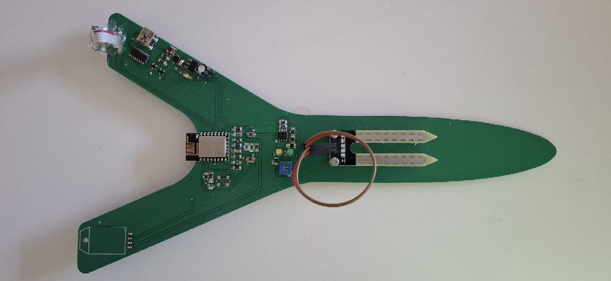

# project-esp-pcb-ndoe

## توضیحات
این پروژه به منظور نمایش نمونه کارها و تجربیات در زمینه طراحی PCB و کار با ESP ایجاد شده است. در ادامه می‌توانید تصاویر مربوط به پروژه‌های انجام شده را مشاهده کنید.

## نمونه کارها

### تصویر ۱

### تصویر ۲

### تصویر ۳

---

## Description
This project is created to showcase portfolio and experience in PCB design and ESP development. Below you can find images of completed projects.

## Portfolio

### Image 1

### Image 2

### Image 3

